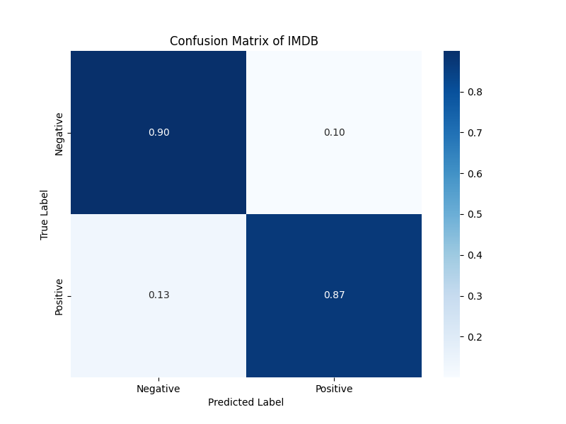
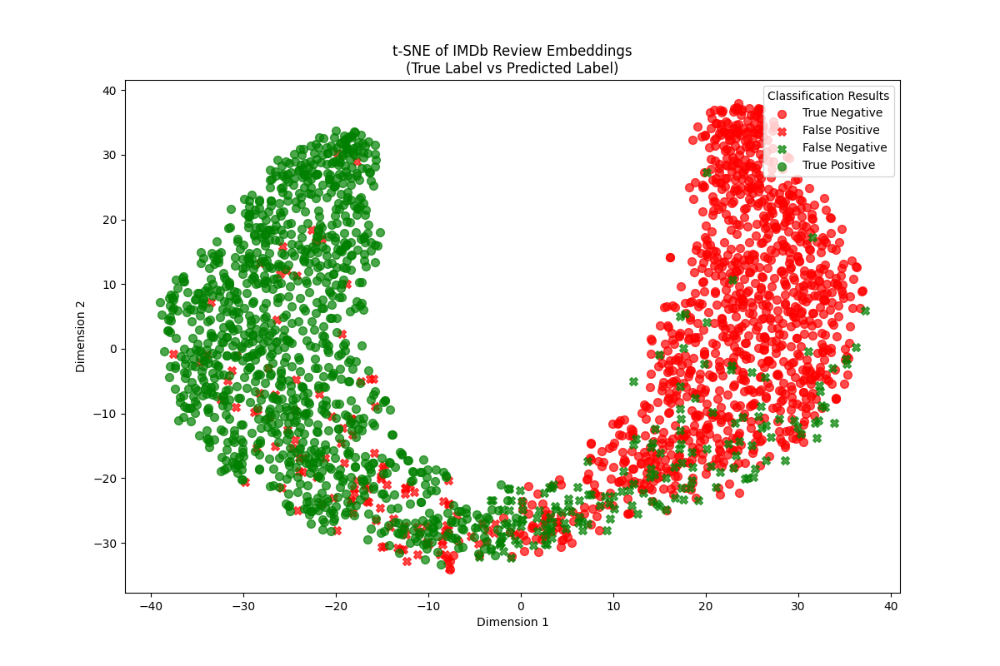

# Binary Sentiment Classification with DistilBERT on IMDB Dataset

This project demonstrates sentiment analysis using a fine-tuned DistilBERT model on the IMDB dataset, leveraging HuggingFace and PyTorch.

## Overview

The codes and the results can be seen in `Imdb_sentiment_analysis_using_pretrained_model.ipynb`. It can also be connected to Colab to reproduce the results.

- Use the `distilbert-base-uncased-finetuned-sst-2-english` model to extract comment embeddings.
- Perform binary sentiment classification (positive/negative) on a small sample of the IMDB test dataset.
- Evaluate model performance with Accuracy, F1 score, and Confusion Matrix.
- Visualize embeddings with t-SNE.
- Analyze misclassified examples for insights.   

## Main Steps

1. Load and preprocess IMDB dataset.
2. Load DistilBERT model and tokenizer.
3. Extract embeddings and predict sentiments.
4. Evaluate classification results.
5. Visualize embeddings in 2D space using t-SNE.
6. Investigate misclassified comments.

This repository serves as an exercise in transformer models, embedding extraction, and visualization for sentiment analysis.

## Results & Visualizations

### Confusion Matrix

The model performs well on this small IMDB sample, with most predictions correctly classified. The model currently shows slightly more false negatives (13%) than false positives (10%).

### t-SNE Embedding Visualization

The t-SNE projection shows distinct clusters for positive and negative reviews, also the prediction from the model, indicating that the DistilBERT embeddings are mostly separable.

### Insights from Misclassified Examples

A review of misclassified comments reveals that many errors occur on sentimentally ambiguous texts. For instance, for `index 2` (see below), which has a positive label but classified as negative sentiment, the reviewer acknowledges flaws and echoes some negative sentiment, but ultimately expresses a favorable opinion. The mixed tone, combined with emotionally charged language, may have confused the model.

> I have no idea why everyone hates this movie to call it garbage a travesty an unexceptable sequel is just unfair i mean what else could they have made for a sequel then. Cause seriously I think it should have had a sequel (Rodney Dangerfield) says: hey everyone were all going to get laid and then a little dancing goffer and thats it thats the end of Caddyshack even though the film rating on first one was (R) and the second one was (PG) it was still lots of fun . (7/10)

Some misclassifications also highlight potential labeling errors. In cases like `index 9` (see below), it is labeled as negative but it is classified as positive with a high confidence. Upon inspection, it seems more appropriate to label it as positive.

> I really liked this quirky movie. The characters are not the bland beautiful people that show up in so many movies and on TV. It has a realistic edge, with a captivating story line. The main title sequence alone makes this movie fun to watch.

## Further Directions (TBD)

- Fine-tune the `DistilBERT` base model on the IMDB training dataset.
- Compare its performance to the currently-used `distilbert-base-uncased-finetuned-sst-2-english` model, which was fine-tuned on a different sentiment analysis dataset (`SST-2`).
- Inspect attentions to investigate what words or phrases affect the model's prediction.
